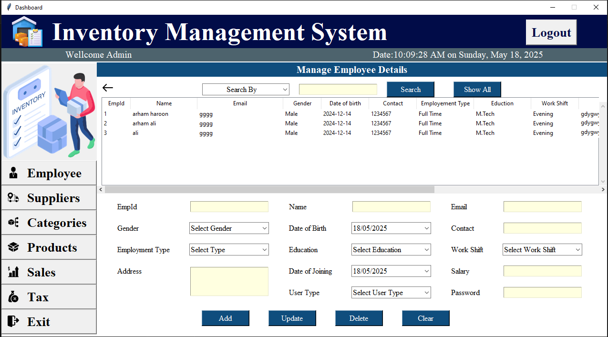
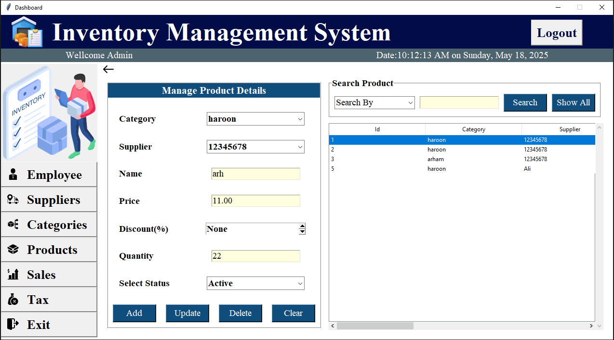
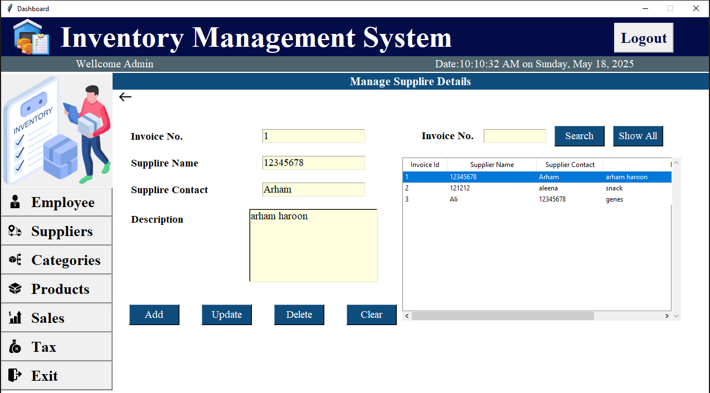
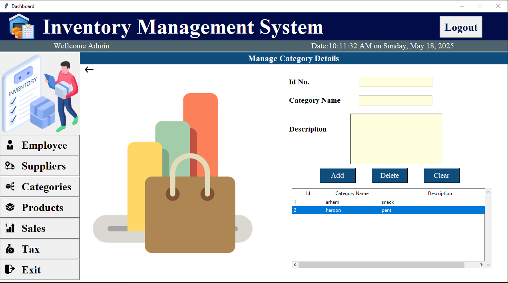
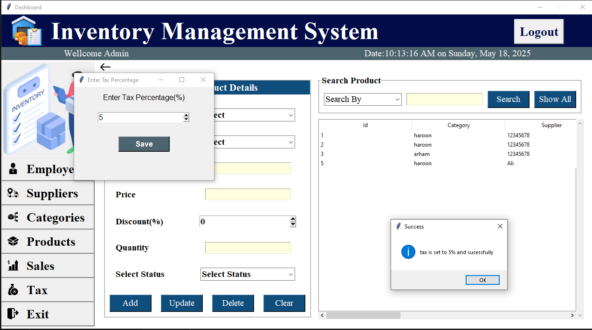

# 🛒 Inventory Management System

A professional, user-friendly inventory management application built with **Python Tkinter**. Effortlessly manage employees, products, suppliers, categories, and taxes through an intuitive GUI—ideal for small businesses.

---

## 🚩 Features

- 🔐 **Admin Login**
- 👥 **Employee Management**
- 📦 **Product Management**
- 🏢 **Supplier Management**
- 🗂️ **Category Management**
- 💸 **Tax Configuration**
- 📊 **Dashboard Overview**
- 🗄️ **SQLite Database**
- 🖼️ **Image Uploads**
- 📤 **Excel Export** *(optional)*

---

## 🛠️ Tech Stack

- 🐍 Python 3.8+
- 🖼️ Tkinter
- 🗄️ SQLite
- 🖼️ Pillow
- 📊 openpyxl *(optional)*

---

## 🖼️ Screenshots







 
---

## 🚀 Quick Start

1. **Install dependencies:**
    ```bash
    pip install pillow openpyxl
    ```
2. **Run the application:**
    ```bash
    python main.py
    ```

---

## 📁 Project Structure

```
InventorySystem/
├── main.py
├── employee.py
├── product.py
├── supplier.py
├── category.py
├── tax.py
├── images/
├── database.db
```

---

## 🔑 Default Admin Credentials

```
Username: admin
Password: admin123
```
*You can change these in `main.py` as needed.*

---

## 🛣️ Roadmap

- 🧾 Sales/Invoice Module
- 📄 PDF/Excel Reports
- 🏷️ Barcode/QR Support
- 👤 User Roles
- 💾 Backup/Restore

---

## 👤 Author

[Mian Arham Haroon](https://github.com/mian-arham-haroon)  
[Portfolio](https://mian-arham-haroon.github.io/arham_portfolio/)  
📧 arham@example.com

---

## 📄 License

MIT License

---

⭐ Star the repository or open an issue for feedback!
